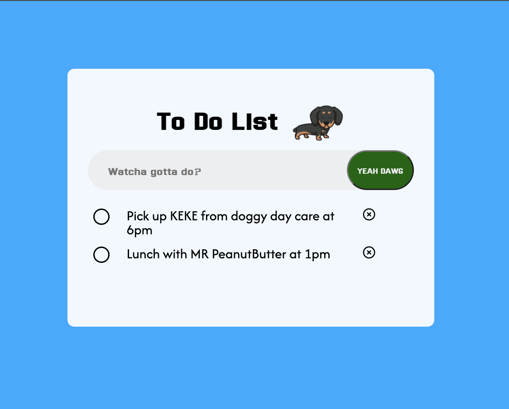

# To Do List Web App

## Description
- This is a simple Todo List app that allows users to create and manage their tasks. The app is built using HTML, CSS, JavaScript, jQuery, and Express. It also utilizes Local Storage to persist the user's tasks even after refreshing the page.

## Feature
- Add Task
  - Users can add new tasks to the list by entering the task description and clicking the "Add" button.

- Delete Task
  - Users can delete a task by clicking the delete icon next to the task.

- Mark as Completed
  - Users can mark a task as completed by clicking the checkbox next to the task.

- Local Storage
  - The app uses Local Storage to store tasks, ensuring that tasks are preserved even when the page is refreshed or reopened.

## Final Product

## Getting Started

1. Fork this repo
2. Git clone the forked repo into your local device
3. Install all dependencies using ```npm install```
4. Start the server in terminal using ```npm run start```
5. Open you browser and go to `http://localhost:8080` to use the ToDo List App